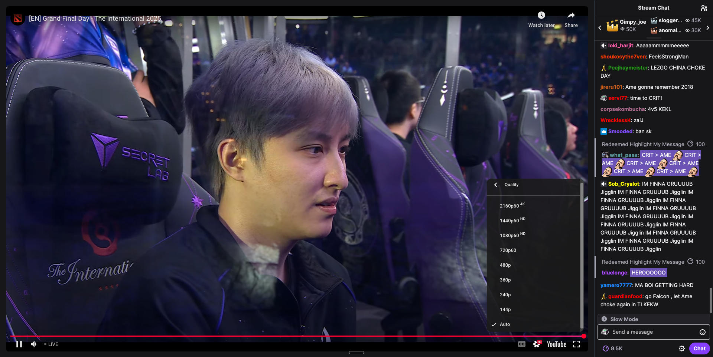

# YouTwitch

Watch Youtube Streams with Twitch Chat. The best of both worlds.

## Why use this?

This application works best when a streamer is streaming on both Twitch and Youtube.

*   Youtube has Higher resolution, playback speed, closed captions, rewind etc.
*   Twitch chat degeneracy is better than youtube live chat.


Here's a glimpse of the YouTwitch application in action:




## Brave Browser Users
If you are using Brave browser, you will need to turn off shields to log in to Twitch chat.

## Project Structure

The project is built with a React frontend, using TypeScript, and includes common web development tools:

*   **`index.html`**: The main HTML file for the application.
*   **`src/`**: Contains the main source code for the React application.
    *   **`src/main.tsx`**: The entry point of the React application.
    *   **`src/App.tsx`**: The root component of the application.
    *   **`src/index.css`**: Global CSS styles.
    *   **`src/vite-env.d.ts`**: TypeScript declaration file for Vite environment variables.
    *   **`src/components/`**: Directory for React components.
        *   **`src/components/StreamViewer.tsx`**: Likely the component responsible for displaying the video stream and related controls/chat.
*   **Configuration Files**:
    *   `package.json`, `package-lock.json`: Node.js package manager files.
    *   `tsconfig.json`, `tsconfig.app.json`, `tsconfig.node.json`: TypeScript configuration files.
    *   `vite.config.ts`: Vite build tool configuration.
    *   `eslint.config.js`: ESLint configuration for code linting.
    *   `postcss.config.js`, `tailwind.config.js`: PostCSS and Tailwind CSS configuration for styling.
*   **Other Files**:
    *   `.gitignore`: Specifies intentionally untracked files to ignore.
    *   `LICENSE`: Project license file.

## Technologies Used

*   **React**: Frontend JavaScript library for building user interfaces.
*   **TypeScript**: Superset of JavaScript that adds static typing.
*   **Vite**: Fast frontend build tool.
*   **Tailwind CSS**: A utility-first CSS framework for rapid UI development.
*   **ESLint**: Pluggable linting utility for JavaScript and JSX.

## Getting Started

To get a local copy up and running, follow these simple steps.

### Prerequisites

Make sure you have Node.js and npm (or yarn) installed.

*   Node.js (LTS recommended)
*   npm (comes with Node.js) or Yarn

### Installation

1.  Clone the repository:
    ```bash
    git clone https://github.com/your-username/youtwitch.git
    ```
2.  Navigate to the project directory:
    ```bash
    cd youtwitch
    ```
3.  Install dependencies:
    ```bash
    npm install
    # or
    yarn install
    ```

### Running the Development Server

To run the application in development mode:

```bash
npm run dev
# or
yarn dev
```

This will start the Vite development server, usually accessible at `http://localhost:5173`.

## Usage

Once the development server is running, open your browser and navigate to the provided local address (e.g., `http://localhost:5173`). You should see the YouTwitch application with a live stream viewer and chat interface.


## License

This project was vibecoded by [@ashvinpanicker](https://github.com/ashvinpanicker/) and [@ashwin-nat](https://github.com/ashwin-nat) on [bolt.new](https://bolt.new/) and [Kilo Code running](https://kilocode.ai/) on [Gemini 2.5 Flash](https://gemini.google.com/). It is free to meddle with, licensed under the [LICENSE](LICENSE) file.

## Warranty 

Your problem, not mine.